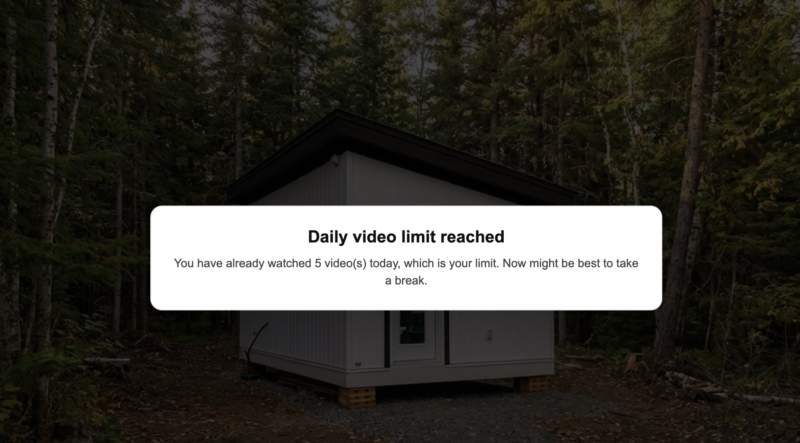
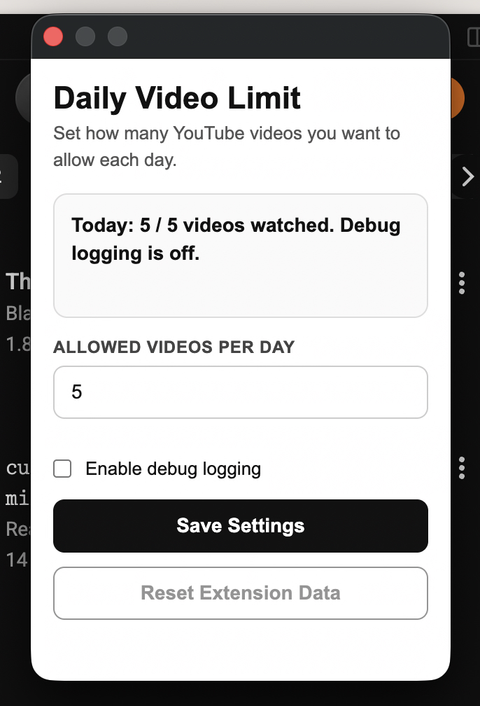

# Daily Video Limit

A lightweight Chrome extension that limits how many YouTube videos you can watch each day.

Daily Video Limit tracks unique YouTube videos locally in your browser, counts a video after it has played for at least 10 seconds, and pauses new videos once you reach your daily allowance.

## Features

- Set a custom daily YouTube video limit from the extension popup.
- Tracks standard YouTube watch pages and YouTube Shorts.
- Counts each unique video only once per day.
- Blocks additional unviewed videos after the daily limit is reached.
- Allows already-counted videos to be reopened on the same day.
- Resets the daily count automatically based on your local date.
- Stores all settings and watch counts locally with `chrome.storage.local`.
- Optional debug logging and debug reset controls.

## How It Works

1. Open a YouTube video or Short.
2. Once playback passes 10 seconds, the extension records that video for the current day.
3. If your daily count is below the limit, playback continues normally.
4. If your limit has already been reached, new unviewed videos are paused and covered with a break reminder.
5. Rewatching a video already counted that day does not increase the count.

<p align="center">
  
</p>

## Installation

This extension is designed to be loaded locally as an unpacked Chrome extension.

1. Download or clone this repository.
2. Open Chrome and go to `chrome://extensions`.
3. Enable **Developer mode**.
4. Click **Load unpacked**.
5. Select this project folder.
6. Open YouTube and use the extension popup to set your daily limit.

## Usage

Click the **Daily Video Limit** extension icon in Chrome to:

- View today's count and current limit.
- Change the allowed number of videos per day.
- Enable or disable debug logging.
- Reset extension data when debug logging is enabled.

The default daily limit is `5` videos.

<p align="center">
  
</p>

## Permissions

The extension requests:

- `storage`: saves your limit, daily count, viewed video IDs, and debug setting locally.
- `https://www.youtube.com/*`: runs the content script on YouTube pages so it can detect videos and pause playback after the limit is reached.

No data is sent to an external server.

## Project Structure

```text
.
├── manifest.json        # Chrome extension manifest
├── service_worker.js    # Background logic, state management, and message handling
├── content.js           # YouTube page detection, playback counting, and blocking overlay
├── docs/
│   └── assets/          # README screenshots
├── popup.html           # Extension popup markup and styles
└── popup.js             # Popup settings, status rendering, and reset behavior
```

## Development Notes

- Built for Chrome Manifest V3.
- Uses plain JavaScript, HTML, and CSS.
- No build step or package installation is required.
- Extension state is keyed by local calendar day in `YYYY-MM-DD` format.

After editing files, reload the extension from `chrome://extensions` to test changes.
